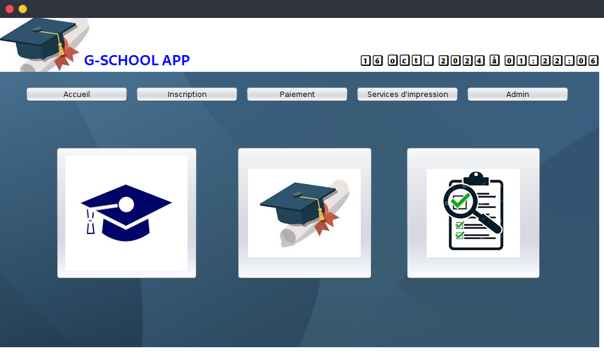
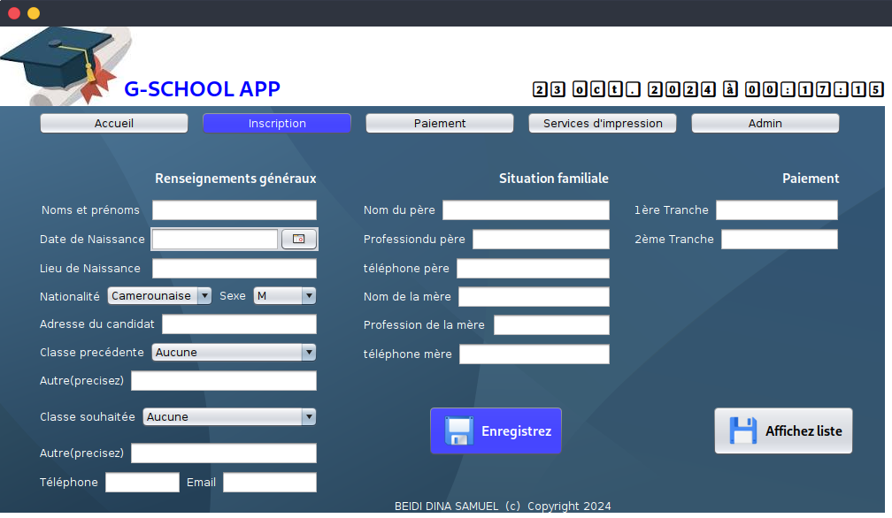

# G-SCHOOL
##  G-SCHOOL - secondary school management application

### the automatic clock
```java
 horloge.setText(
           DateFormat.getDateTimeInstance().format(new Date())
         );
         Timer t = new Timer(500, new ActionListener() {
            @Override
            public void actionPerformed(ActionEvent e) {
              horloge.setText(
                 DateFormat.getDateTimeInstance().format(new Date())
              );
            }
         });
         t.setRepeats(true);
         t.setCoalesce(true);
         t.setInitialDelay(0);
         t.start();
            
```
note that `horloge` is a Jlabel just placed below the G-SCHOOL title


# menu 


# Accueil



# Inscription



# Sql code Table Inscription

```sql
BEGIN TRANSACTION;
CREATE TABLE IF NOT EXISTS "Inscription" (
	"ID"	INTEGER,
	"Noms"	TEXT,
	"DateNaissance"	TEXT,
	"LieuNaissance"	TEXT,
	"Pays"	TEXT,
	"Sexe"	TEXT,
	"Adresse"	TEXT,
	"ClassePrecedente"	TEXT,
	"AutrePrecedente"	TEXT,
	"Classe"	TEXT,
	"AutreClasse"	TEXT,
	"Telephone"	INTEGER,
	"Email"	TEXT,
	"NomPere"	TEXT,
	"ProfessionPere"	TEXT,
	"Telpere"	INTEGER,
	"NomMere"	TEXT,
	"ProfessionMere"	TEXT,
	"telMere"	INTEGER,
	"PremiereT"	INTEGER,
	"DeuxiemeT"	INTEGER,
	PRIMARY KEY("ID" AUTOINCREMENT)
);
COMMIT;
```
