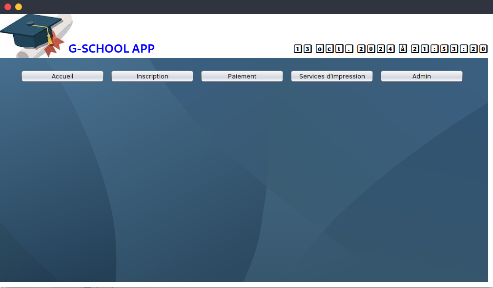

-- Active: 1724681452388@@127.0.0.1@3306
# G-SCHOOL
##  G-SCHOOL - secondary school management application

### the automatic clock
```java
 horloge.setText(
           DateFormat.getDateTimeInstance().format(new Date())
         );
         Timer t = new Timer(500, new ActionListener() {
            @Override
            public void actionPerformed(ActionEvent e) {
              horloge.setText(
                 DateFormat.getDateTimeInstance().format(new Date())
              );
            }
         });
         t.setRepeats(true);
         t.setCoalesce(true);
         t.setInitialDelay(0);
         t.start();
            
```
note that `horloge` is a Jlabel just placed below the G-SCHOOL title


# menu 

